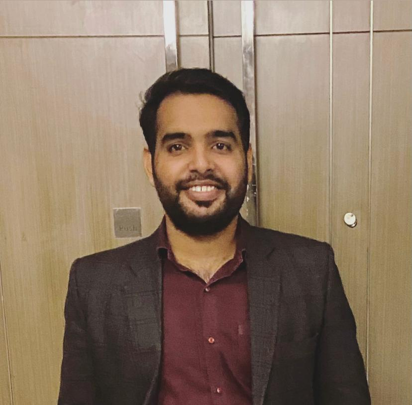
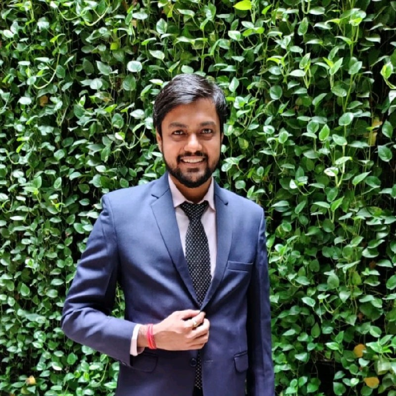

1. **Bhupender Kumar**  Head – Assurance and International Taxation  DUE DILIGENCE 
    
    Bhupender is a qualified Chartered Accountant and an Associate member of the Institute of Chartered Accountants of India. He has more than 7 years of experience in the direct taxation and its litigation. He is an Ex- KPMG (Member of the Big 4 Audit firm).  
    During his professional journey, he has gained in-depth experience in the areas of International Taxation (including the Expatriate Taxation), Transfer Pricing matters and Corporate Taxation. He has built enduring relationship with clients by providing most cost efficient and highly professional services. He always believes in satisfying clients with providing high quality services to attain goals and objectives of clients as well as the firm. He has defined his values by the way of excellence, credibility and commitment towards the work he performs and continuously guides us to the road of success. He has been following ethical business principles to underline the true value of our esteemed organization.  
    Expert in Consultancy and Advisory on Income Tax related matters, Assessment of High-Net-Worth Individuals. He has worked closely with the promoters/management in setting up financial processes and internal financial controls to fill gaps in MIS reporting and compliance, thereby ensuring smooth finance functions in the organisation. With his rich experience, Bhupender has assisted the promoters/corporates to simplify complex accounting, taxation and financial aspects of the business. He is a future-oriented leader who looks forward to fulfilling his Corporate social responsibilities by imparting the skill among the youth and providing them livelihood opportunities.  

2. **Bhubanesh Pinani**  Head – Taxation and Financial advisory  
    
    Bhubanesh is a finance professional who is looking after the overall taxation and financial planning of the clients. He has more than 5 years of experience in the domain of taxation and financial planning.  
    A well-known professional for his skills in delivering innovative ideas and efficient tax planning to clients in growing their businesses. He carries expertise in successfully providing a roadmap and financial strategies to corporates, proprietorship, partnership firm etc. His good analytical and decision-making ability.  
    Bhubanesh has 5+ years of experience rendering professional services. An advisor on strategic issues and provides a perspective on global trends and emerging practices on client assignments. His ability to relate the business strategies of clients to the tax and regulatory environment has been recognized as unique and has played a critical role in evolving solutions for client. While performing as a perfect professional in his sector he aims to educate and aware youth of their financial responsibilities.  

3. **Mohit Jain**  Head  - CFO Services
    
    Mohit is a member of the Institute of Chartered Accountants of India and the Institute of Cost Accountants of India. He is also a qualified Company Secretary and a Registered Valuer (Securities & Financial Assets) with the Insolvency and Bankruptcy Board of India.  
    Mohit has more than 12 years of experience in the accounting and financial domain. He has extensive experience in a wide spectrum of finance functions including system set-up, planning, modelling, process automation, MIS reporting, valuation, and advisory. He has worked closely with the promoters/management in setting up financial processes and internal financial controls to fill gaps in MIS reporting and compliance, thereby ensuring smooth finance functions in the organisation. Previously, Mohit has been associated with Powergrid Corporation of India, Jindal Stainless Steel, and HCL Infosystem as a part of their finance team. He has also worked as a Finance Controller of a start-up, viz., ThinkLink.  
    With his rich experience, Mohit assists the promoters/corporates to simplify complex accounting and financial aspects of the business. He also specializes in providing audit and assurance services to clients in various sectors including manufacturing, services, and trading.

4. **Hitesh Gupta (Bcom, ACA)**
    Head – Direct & Indirect Tax
    
    
    Hitesh is a member of the Institute of Chartered Accountants of India. Previously, Hitesh has been associated with Big 4s as a consultant in Indirect Tax Department. 
    He is responsible for tax advisory and litigation services in our organization. His core area of expertise includes GST Audits and Compliances, representing clients before various income tax and GST authorities in the field of assessments, appeals, and various proceedings. 
    He has served and advised many clients in the fields he is an expert in and has always proved to be of great help to all our valued clients. In his opinion, the impossible is just an opinion. One of his strengths is his readiness to do whatever it takes to get the work done, and he can always be counted on.

5. **Akash Kumar Mathur** 
    Manager – Secretarial Compliance
    <!--  -->
    
    Akash holds a bachelor’s degree in Commerce from Delhi University and previously gave his professional services to various CA firms and Corporates including Indira Gandhi International Airport, Delhi.
    He is a competent and result-oriented professional with more than 5 years of experience in professional services given to chartered accountancy firms. He has good fundamentals in the field of Accounting, Finance & Taxation. His good analytical and decision-making skills make him an expert in resolving queries.
    He desires to evolve as a leader who is specialized in his field and creates employability opportunities for the youth.